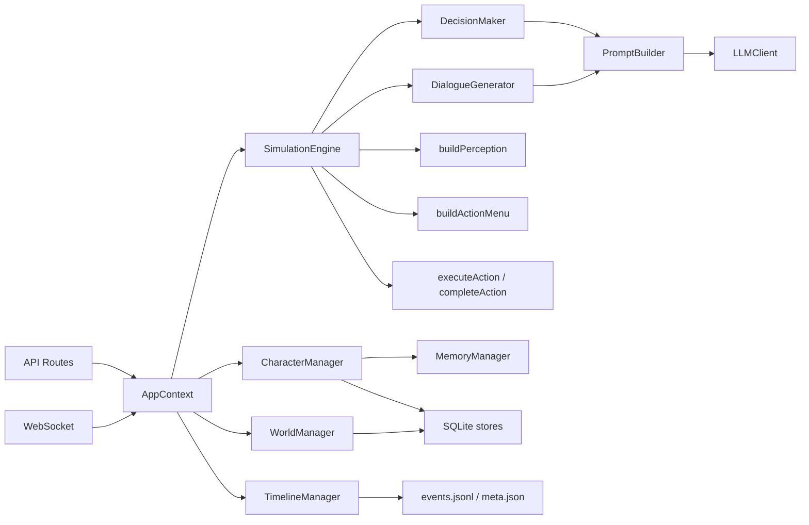

# WorldX 运行时类与模块职责

本文档整理当前运行时主要类、函数模块和数据边界。它不是完整 API 文档，而是用于理解代码如何协作。

## 总览

运行时核心分为五层：

1. **入口层**：Express routes、WebSocket。
2. **上下文层**：`AppContext` 负责装配和切换世界/时间线。
3. **核心管理层**：`WorldManager`、`CharacterManager`、`MemoryManager`。
4. **模拟执行层**：`SimulationEngine`、`DecisionMaker`、`DialogueGenerator`、perceiver/action-menu/action-executor。
5. **存储层**：SQLite store modules。



## AppContext

文件：`server/src/services/app-context.ts`

`AppContext` 是运行时容器，负责把所有服务组装起来。

主要职责：

- 初始化世界目录。
- 初始化或切换 timeline。
- 打开当前 timeline 的 SQLite DB。
- 创建 `WorldManager`、`CharacterManager`、`LLMClient`、`PromptBuilder`、`SimulationEngine`。
- 处理新 timeline、切 timeline、切世界。
- 开始 timeline recording。
- 维护 `eventBus`。

关键方法：

| 方法 | 作用 |
| --- | --- |
| `initialize(worldDirPath?)` | 启动运行时 |
| `switchWorld(worldDirPath)` | 切换世界 |
| `switchTimeline(timelineId)` | 切换时间线 |
| `createNewTimeline()` | 当前世界创建新时间线 |
| `resetWorldState()` | 当前实现等价于创建新时间线 |
| `setDevTickDurationMinutes(minutes)` | 开发模式修改 tick 粒度，并创建新时间线 |
| `rebuildRuntime()` | 重新装配所有 runtime manager |

边界：

- 它不负责具体模拟逻辑。
- 它负责生命周期和依赖注入。

## TimelineManager

文件：`server/src/services/timeline-manager.ts`

`TimelineManager` 管理 timeline 文件结构。

主要职责：

- 创建 timeline ID。
- 选择最新 timeline 或创建新 timeline。
- 写入 `meta.json`。
- 记录 `events.jsonl`。
- 列出和删除 timeline。
- 管理当前 recording stream。

文件结构：

```text
library/worlds/<world_id>/timelines/<timeline_id>/
  meta.json
  events.jsonl
  state.db
```

关键方法：

| 方法 | 作用 |
| --- | --- |
| `initialize(worldDir, timelineId?)` | 选择或创建 timeline |
| `createTimeline(worldDir)` | 创建新 timeline |
| `startRecording(characters)` | 打开 events stream，必要时写 init frame |
| `appendTickEvents(gameTime, events)` | 向 events.jsonl 追加 tick frame |
| `listTimelines(worldDir)` | 列出当前世界 timelines |
| `listAllTimelinesGrouped()` | 按世界分组列出 timelines |
| `deleteTimeline(worldDir, timelineId)` | 删除 timeline |

边界：

- SQLite schema 不在这里管理。
- 具体模拟事件内容由 `SimulationEngine` 产生。

## WorldManager

文件：`server/src/core/world-manager.ts`

`WorldManager` 管理世界静态配置和世界运行态。

主要职责：

- 加载 `config/world.json` 和 `config/scene.json`。
- 管理地点、物件、交互、世界动作。
- 管理时间推进。
- 管理世界对象状态。
- 管理 dialogue session 的保存和读取。
- 管理 `world_global_state`。
- 处理场景转场、快照和临时状态重置。

关键数据：

- `worldName`
- `worldDescription`
- `worldSocialContext`
- `contentLanguage`
- `sceneConfig`
- `locationConfigs`
- `mainAreaPoints`
- `worldActions`

关键方法类型：

| 类型 | 例子 |
| --- | --- |
| 世界信息 | `getWorldName()`、`getWorldDescription()`、`getContentLanguage()` |
| 时间 | `getCurrentTime()`、`advanceTick()`、`syncSceneClock()` |
| 地点 | `getLocation()`、`getAllLocations()`、`getAdjacentLocations()` |
| 物件 | `getLocationObjects()`、`getAvailableInteractions()` |
| 动作 | `getWorldActions()`、`getWorldAction()` |
| 主区域点位 | `getMainAreaPoint()`、`pickDistantMainAreaPointId()` |
| 对话 session | `saveDialogueSession()`、`listDialogueSessions()`、`deleteDialogueSession()` |
| 全局状态 | `setGlobal()`、`getGlobal()` |

边界：

- 不直接调用 LLM。
- 不决定角色行为。
- 提供世界规则和状态读写能力。

## CharacterManager

文件：`server/src/core/character-manager.ts`

`CharacterManager` 管理角色设定、运行态、生命状态和日记。

主要职责：

- 加载角色配置。
- 初始化角色运行态。
- 获取和更新 `character_states`。
- 管理存活角色过滤。
- 日终推进生命系统。
- 转发记忆相关能力到 `MemoryManager`。
- 写入日记。

角色分两层：

| 层 | 来源 | 特点 |
| --- | --- | --- |
| `CharacterProfile` | JSON 配置归一化 | 稳定人设 |
| `CharacterState` | SQLite `character_states` | 易变运行态 |

关键方法：

| 方法 | 作用 |
| --- | --- |
| `initialize()` | 加载 profile 并初始化 state 和初始记忆 |
| `getProfile(charId)` | 获取角色设定 |
| `getAllProfiles()` | 获取所有角色设定，包括死亡角色 |
| `getAliveProfiles()` | 获取存活角色设定 |
| `isAlive(charId)` | 判断角色是否存活 |
| `getState(charId)` | 获取运行态 |
| `updateState(charId, patch)` | 更新运行态 |
| `tickPassiveUpdate(charId, currentTime)` | 每 tick 被动更新 |
| `resetStatesForNewScene()` | 新一天重置存活角色位置和动作 |
| `advanceLifeAtEndOfDay(gameTime)` | 日终推进年龄/健康/死亡 |
| `markDead(charId, gameTime, cause)` | 标记死亡并生成事件 |
| `getCharactersAtLocation(locationId)` | 获取某地点存活角色 |

生命状态字段：

- `ageYears`
- `ageDays`
- `lifeStage`
- `health`
- `bodyCondition`
- `isAlive`
- `deathDay`
- `deathTick`
- `deathCause`

边界：

- 不直接决定下一步动作。
- 不直接调用 LLM 做行为决策。

## MemoryManager

文件：`server/src/core/memory-manager.ts`

`MemoryManager` 管理角色私有记忆。

主要职责：

- 添加记忆。
- 检索相关记忆。
- 按天查询记忆。
- 获取传闻记忆。
- 记忆衰减。
- 记忆整合。
- 缓存清理。
- 使用 BM25 + embedding cosine 做异步相关记忆检索。

重要边界：

- 记忆以 `character_id` 隔离。
- 决策检索只读取当前角色自己的记忆。
- 跨角色信息必须通过对话、观察、广播、传闻等机制写入自己的记忆后才会被检索。
- `.env` 中的 `EMBEDDING_MODEL` 控制 embedding 检索；`EMBEDDING_BASE_URL` 和 `EMBEDDING_API_KEY` 未设置时复用 `SIMULATION_*`。

## SimulationEngine

文件：`server/src/simulation/simulation-engine.ts`

`SimulationEngine` 是运行时主循环。

主要职责：

- 推进单 tick。
- 推进整天或多天。
- 调度角色被动更新。
- 调度 LLM 决策。
- 调度动作执行。
- 调度对话 session。
- 调度小反思、日终反思和记忆评估。
- 生成事件并落库。
- 跨天时执行转场和生命系统。

关键方法：

| 方法 | 作用 |
| --- | --- |
| `simulateTick()` | 单 tick 主流程 |
| `simulateDay()` | 循环多个 tick |
| `simulateDays(count)` | 多日推进 |
| `prepareCharacterForTick()` | 判断角色动作是否结束、是否需要决策 |
| `buildTickIntents()` | 并发生成角色决策 |
| `selectDialogueSessions()` | 选择本 tick 要推进的对话 |
| `runDialogueSession()` | 生成对话 turn / finalize |
| `runMicroReflectionWave()` | 小反思 |
| `runReflection()` | 日终反思 |
| `finalizeTickEvents()` | 计算戏剧分、写事件 |
| `runCycleTransition()` | 跨天流程 |

边界：

- 它编排流程，但具体感知、菜单、动作、对话生成拆到其他模块。

## DecisionMaker

文件：`server/src/simulation/decision-maker.ts`

`DecisionMaker` 负责为单个角色生成下一步行动意图。

输入：

- `charId`
- `Perception`
- `actionMenu`
- `gameTime`

过程：

1. 获取角色 profile 和 state。
2. 从当前感知生成检索关键词。
3. 检索该角色自己的相关记忆 top 5。
4. 读取当前关注点 `current_focus:<charId>`。
5. 调用 `PromptBuilder.buildReactiveDecisionMessages()`。
6. 用 `LLMClient.call()` 请求 `ActionDecisionSchema`。

输出：

```ts
ActionDecision
```

字段包括：

- `actionType`
- `targetId`
- `interactionId`
- `reason`
- `innerMonologue`

边界：

- 只决定做什么或找谁说话。
- 不生成实际对话台词。

## DialogueGenerator

文件：`server/src/simulation/dialogue-generator.ts`

`DialogueGenerator` 负责生成对话台词和对话收尾记忆。

主要职责：

- 为 dialogue session 生成下一句。
- 对话结束时生成双方记忆摘要。
- 构建对话上下文。
- 处理 LLM 失败 fallback。

关键方法：

| 方法 | 作用 |
| --- | --- |
| `generateNextTurn()` | 生成下一句台词 |
| `finalizeDialogueSession()` | 对话收尾 |
| `buildDialogueContext()` | 检索双方关于对方的记忆和传闻 |

输出：

- `DialogueTurnGeneration`
- `DialogueResult`

边界：

- 它不决定角色是否要开启对话。
- 是否能开始对话由 `SimulationEngine.canStartDialogue()` 判断。

## PromptBuilder

文件：`server/src/llm/prompt-builder.ts`

`PromptBuilder` 负责把运行时结构化数据渲染成 LLM prompt。

模板目录：

```text
server/configs/prompts/
```

主要模板：

| 模板 | 用途 |
| --- | --- |
| `reactive-decision.md` | 行动决策 |
| `dialogue-turn.md` | 对话下一句 |
| `dialogue-finalize.md` | 对话收尾 |
| `micro-reflection.md` | 小反思 |
| `reflection.md` | 日终反思 |
| `memory-eval.md` | 记忆评估 |
| `diary.md` | 日记 |
| `sandbox-chat.md` | 沙盒聊天 |

关键能力：

- 注入世界语言提示。
- 格式化情绪。
- 格式化身体状态。
- 格式化感知文本。
- 格式化角色标志性提示。
- 格式化对话 transcript。

边界：

- 不调用 LLM。
- 只构建 messages。

## LLMClient

文件：`server/src/llm/llm-client.ts`

`LLMClient` 负责调用 OpenAI-compatible Chat Completions API。

主要职责：

- 读取 `SIMULATION_*` 环境变量。
- 调用模型。
- 支持结构化输出模式。
- 处理 JSON 提取和 Zod 校验。
- 网络重试。
- timeout。
- 记录 LLM 调用日志。

相关环境变量：

- `SIMULATION_BASE_URL`
- `SIMULATION_API_KEY`
- `SIMULATION_MODEL`
- `SIMULATION_NETWORK_RETRIES`
- `SIMULATION_DECISION_CONCURRENCY`
- `SIMULATION_STRUCTURED_OUTPUT_MODE`
- `SIMULATION_TIMEOUT_MS`

边界：

- 不知道业务语义。
- 只负责可靠调用和结构化校验。

## buildPerception

文件：`server/src/simulation/perceiver.ts`

纯函数模块，负责构建单个角色当前看到的世界。

输出 `Perception`：

- `currentLocation`
- `locationDescription`
- `myZone`
- `objectsHere`
- `charactersHere`
- `recentEnvironmentChanges`
- `recentActions`

过滤规则：

- 死亡角色不进入 `charactersHere`。
- `main_area` 会按全局主区域点位处理；其他地点按 location 过滤。
- 只有明显情绪才暴露 `emotionLabel`。

## buildActionMenu

文件：`server/src/simulation/action-menu-builder.ts`

纯函数模块，负责把当前状态和感知转成可选择动作列表。

生成菜单类别：

- `【全局功能】`
- `【可交互物件】`
- `【在场的人】`
- `【移动】`
- `【其他】`

重要规则：

- LLM 只能从菜单里选动作。
- 菜单中带精确 ID，后续会用这些 ID 执行动作。
- anchored 角色受限。
- 最近做过的不可重复交互会被冷却过滤。

## action-executor

文件：`server/src/simulation/action-executor.ts`

函数模块，负责执行非对话动作。

主要函数：

| 函数 | 作用 |
| --- | --- |
| `executeAction()` | 根据 `ActionDecision` 开始动作 |
| `completeAction()` | 动作到期后完成动作 |

动作执行会更新：

- `character_states`
- `world_object_states`
- `events`

交互和全局动作的配置时长使用 `durationMinutes`，运行时由 `getDurationTicks()` 按当前 `tickDurationMinutes` 换算成 `actionEndTick`。旧配置里的 `duration` 仍兼容为旧版 tick 数。

动作类型：

- `interact_object`
- `world_action`
- `move_to`
- `move_within_main_area`
- `idle`

`talk_to` 只生成一个行动意图，真正对话由 `SimulationEngine` 接管。

## Store Modules

目录：`server/src/store/`

| 模块 | 表 | 作用 |
| --- | --- | --- |
| `db.ts` | all | 初始化 SQLite、schema、migration |
| `character-state-store.ts` | `character_states` | 角色运行态 CRUD |
| `memory-store.ts` | `memories` | 记忆 CRUD 和查询 |
| `event-store.ts` | `events` | 事件写入和查询 |
| `world-state-store.ts` | `world_object_states`、`world_global_state` | 世界运行态 |
| `snapshot-store.ts` | `snapshots` | 世界快照 |
| `content-store.ts` | `content_candidates` | 内容候选 |

存储边界：

- 当前 timeline 一份 `state.db`。
- 切 timeline 会关闭旧 DB，打开新 DB。
- timeline 事件同时存在 SQLite `events` 和 `events.jsonl`。

## API Routes

目录：`server/src/api/routes/`

| Route | 作用 |
| --- | --- |
| `simulation.ts` | tick/day/days/pause/status |
| `world.ts` | 世界信息、地点、切世界等 |
| `timeline.ts` | timeline 创建、切换、删除、事件读取 |
| `characters.ts` | 角色列表、详情、人设编辑、运行态更新、记忆 |
| `events.ts` | 查询事件 |
| `god.ts` | 上帝模式广播和 whisper |
| `sandbox-chat.ts` | 独立沙盒聊天 |
| `worlds-create.ts` | 创建新世界 |
| `content.ts` | 内容候选 |

## WebSocket

文件：`server/src/api/websocket.ts`

WebSocket 监听 `AppContext.eventBus`：

- `tick_events` -> `simulation_events`
- 高戏剧分事件 -> `highlight_detected`
- `simulation_status` -> `simulation_status`

前端通过这些消息更新地图、事件流和运行状态。

## Frontend Runtime Consumers

主要前端消费位置：

| 模块 | 作用 |
| --- | --- |
| `client/src/scenes/WorldScene.ts` | 地图渲染、角色 sprite 同步、事件播放 |
| `client/src/ui/panels/TopBar.tsx` | 运行/暂停/切世界/切 timeline |
| `client/src/ui/panels/SidePanel.tsx` | 角色列表和详情入口 |
| `client/src/ui/panels/CharacterDetail.tsx` | 角色状态、历史、记忆、人设编辑 |
| `client/src/ui/panels/DialoguePanel.tsx` | 最近对话 |
| `client/src/ui/panels/EventFeed.tsx` | 事件流 |
| `client/src/ui/services/api-client.ts` | HTTP API 封装 |

前端不会直接改 DB，所有状态变化都通过 API 和 WebSocket 同步。
