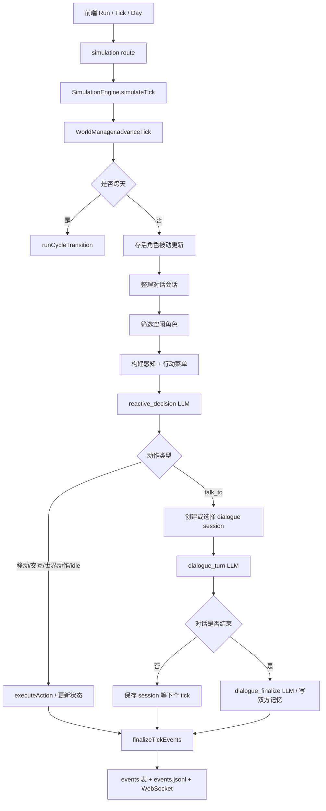

# WorldX 运行时 Pipeline

本文档描述 WorldX 当前运行时的真实执行链路。它以代码实现为准，重点覆盖 tick 推进、LLM 调用、状态落库、事件推送、时间线记录，以及角色死亡后的过滤规则。

## 总览

运行时是一个 tick 驱动的同步模拟循环。前端发起运行请求后，后端每推进一个 tick，会让存活角色感知环境、做 LLM 决策、执行动作或推进对话，然后把状态和事件写入当前 timeline 的 SQLite 数据库，并通过 WebSocket 推给前端。



## 启动和时间线初始化

入口在 `server/src/index.ts`：

1. `resolveInitialWorldDir()` 选择初始世界。
2. `AppContext.initialize(worldDir)` 初始化当前世界。
3. `TimelineManager.initialize(worldDir)` 选择或创建 timeline。
4. `initDatabase(state.db)` 打开当前 timeline 的 SQLite。
5. `rebuildRuntime()` 创建运行时对象。
6. `beginRecording()` 写入 timeline 初始帧。
7. `setupWebSocket()` 把事件总线广播到前端。

当前实现里，若没有用户生成世界，默认库世界是中文示例 `world_2026-04-19T08-31-24`。

## HTTP 入口

运行接口在 `server/src/api/routes/simulation.ts`：

| 接口 | 行为 |
| --- | --- |
| `POST /api/simulation/tick` | 推进 1 tick |
| `POST /api/simulation/day` | 推进当前场景的一整天 |
| `POST /api/simulation/days` | 推进多天 |
| `POST /api/simulation/pause` | 设置取消标记，批量推进在下一 tick 停下 |
| `GET /api/simulation/status` | 返回运行状态和进度 |

`day` 和 `days` 本质上都是循环调用 `simulateTick()`。

## 单 Tick 过程

核心方法是 `SimulationEngine.simulateTick()`。

### 1. 推进世界时间

先调用 `worldManager.advanceTick()`。它返回：

- `previousTime`
- `currentTime`
- `didAdvanceDay`

如果 `didAdvanceDay = true`，不再跑普通角色决策，而是进入跨天流程。

### 2. 取存活角色

当前 tick 只处理：

```ts
characterManager.getAliveProfiles()
```

死亡角色仍保留在 DB 里，但不会进入模拟循环。

### 3. 被动状态更新

每个存活角色先执行：

```ts
characterManager.tickPassiveUpdate(char.id, gameTime)
```

当前主要做：

- 情绪自然衰减
- 需求/好奇心变化

### 4. 整理对话会话

`reconcileDialogueSessions()` 会：

- 删除非 active 的 dialogue session。
- 删除死亡角色参与的 dialogue session。
- 清理已经没有有效 session 但仍处于 `in_conversation` 的角色状态。

### 5. 筛选需要决策的角色

`prepareCharacterForTick()` 判断角色是否需要发起决策：

- 如果角色有 `currentAction`，且不是 `in_conversation`，并且当前绝对 tick 已达到 `actionEndTick`，先调用 `completeAction()`。
- 如果完成后仍有 `currentAction`，本 tick 不决策。
- 空闲角色进入 `decisionEligible`。

普通动作结束判断：

```ts
state.currentAction &&
state.currentAction !== "in_conversation" &&
absNow >= state.actionEndTick
```

对话不靠 `actionEndTick` 结束，而是靠 dialogue session 状态和 LLM 返回的 `shouldContinue`。

## 决策上下文构建

决策入口是 `DecisionMaker.makeDecision()`。

每个空闲角色会发起一个 `reactive_decision` LLM 请求。这个请求决定角色接下来做什么，或者找谁说话。它不直接生成台词。

### 上下文来源

最终 prompt 由 `PromptBuilder.buildReactiveDecisionMessages()` 套入 `server/configs/prompts/reactive-decision.md`。

包含以下信息：

| 上下文块 | 来源 |
| --- | --- |
| 角色身份 | `CharacterProfile.name / role / speakingStyle` |
| 当前时间 | `GameTime` + `tickToSceneTimeWithPeriod()` |
| 当前状态 | `CharacterState`，包含位置、情绪、年龄、健康、身体情况 |
| 当前关注点 | `world_global_state.current_focus:<charId>` |
| 世界背景 | `WorldManager.getWorldSocialContext()` |
| 当前感知 | `buildPerception()` |
| 相关记忆 | `MemoryManager.retrieveMemories()`，只取该角色自己的 top 5 |
| 行动菜单 | `buildActionMenu()` |
| 输出约束 | `ActionDecisionSchema` + prompt 文本 |

### 感知内容

`buildPerception()` 会生成：

- 当前地点名和描述。
- 当前地点可见物件。
- 物件状态和可用交互。
- 当前能看到的存活角色。
- 其他角色的当前动作、明显情绪、外貌提示、身体异常。
- 最近 2 tick 的本地事件和全局广播。
- 自己最近 6 tick 做过的事。

### 相关记忆

相关记忆只来自当前角色自己的记忆：

```ts
retrieveMemories({
  characterId: charId,
  currentTime: gameTime,
  contextKeywords,
  relatedLocation: state.location,
  topK: 5,
})
```

`contextKeywords` 来自当前地点和可见角色，不会直接读取其他角色的私有记忆。跨角色信息只能通过对话、广播、观察、传闻等机制写入自己的记忆后再被检索出来。

### 行动菜单

`buildActionMenu()` 会列出 LLM 可以选择的动作：

- `[world_action]`：世界通用动作。
- `[interact_object]`：当前地点可交互物件。
- `[talk_to]`：可聊天角色。
- `[move_to]`：相邻地点移动。
- `[move_within_main_area]`：主区域内部移动。
- `[idle]`：兜底动作。

菜单会过滤：

- 死亡角色。
- 正在对话的角色。
- 不可重复且最近刚做过的交互。
- 已满员的物件。
- anchored 角色不能执行不合规移动和普通物件交互。

## 动作执行

非对话动作通过 `executeAction()` 执行。

| 动作类型 | 状态变化 | 事件 |
| --- | --- | --- |
| `interact_object` | 设置 `currentAction = interactionId`，占用物件，设置 `actionEndTick` | `action_start` |
| `world_action` | 设置 `currentAction = action.id`，设置 `actionEndTick` | `action_start` |
| `move_to` | 更新 `location`，设置 `traveling`，通常持续 1 tick | `movement` |
| `move_within_main_area` | 更新 `mainAreaPointId`，设置 `traveling` | `movement` |
| `idle` | 设置短时间 idle | `action_start` |

配置里的交互和全局动作使用 `durationMinutes` 表示世界内真实分钟数。运行时会按当前 `tickDurationMinutes` 转成 tick 数：

```ts
durationTicks = Math.max(1, Math.ceil(durationMinutes / tickDurationMinutes))
```

旧世界如果还只有 `duration` 字段，会按旧语义兼容为 tick 数，并按 15 分钟/ tick 换算成 `durationMinutes`。

动作到期后，`completeAction()` 会：

- 释放物件占用。
- 应用交互效果。
- 清空或更新 `currentAction`。
- 生成 `action_end` 等事件。

## 对话流程

`reactive_decision` 如果返回 `talk_to`，只代表“想找谁说话”，不是实际台词。

对话流程由 dialogue session 驱动：

1. `selectDialogueSessions()` 处理当前活跃会话和新发起会话。
2. `canStartDialogue()` 检查双方是否存活、是否空闲、是否位置兼容。
3. `createDialogueSession()` 创建 session，并把双方状态设为 `in_conversation`。
4. `runDialogueSession()` 每 tick 最多生成 2 句。
5. 每句调用一次 `dialogue_turn` LLM。
6. 如果 `shouldContinue = false`，调用 `dialogue_finalize`。
7. finalize 会为双方写入本次对话摘要记忆。
8. 结束后双方进入短暂 `post_dialogue`。

对话结束来源：

- LLM 返回 `shouldContinue = false`。
- 双方状态不再兼容。
- 一天结束。
- session 损坏或角色死亡。

## 记忆和关系

当前没有显式 `relationships` 表。角色关系主要由各自的记忆承担。

决策时只检索当前角色自己的记忆。对话时会分别检索：

- A 关于 B 的记忆。
- B 关于 A 的记忆。

对话结束后，`dialogue_finalize` 会分别写入双方自己的记忆摘要。

相关记忆检索是 hybrid retrieval：

- 候选集只来自当前角色自己的 `memories`。
- 文本相关性使用 BM25，输入包括记忆内容、tags、相关角色、地点和物件。
- 如果 `.env` 配置了 `EMBEDDING_MODEL`，会调用 OpenAI-compatible `/embeddings` 生成 query 和 memory embedding，并用 cosine similarity 参与相关性。
- 最终 relevance 由 `BM25 + embedding cosine + relatedCharacters/relatedLocation bonus` 组成；embedding 不可用时自动退回 BM25。
- 排序总分还会叠加 recency、importance、emotionalIntensity。

此外还有：

- `memory_formed`：观察到他人明显情绪时可能生成。
- `memory_eval`：后台评估新记忆重要性、情绪强度和 tags。
- `reflection`：阶段性反思会形成新记忆。
- `memory decay / consolidation`：跨天时进行衰减和整合。

## 小反思和日终反思

### Micro Reflection

`shouldRunMicroReflectionWave()` 按小时触发。每个存活角色如果最近记忆足够，会调用 `micro_reflection`，可能：

- 写入 reflection 记忆。
- 调整情绪。
- 更新 `current_focus:<charId>`。

### End-of-Day Reflection

跨天时 `runReflection()` 会基于当天记忆调用 `reflection` LLM，生成更大的反思结果，并可能调整情绪和当前关注点。

## 生命系统

生命系统在跨天阶段推进。

当前字段在 `character_states`：

- `age_years`
- `age_days`
- `life_stage`
- `health`
- `body_condition`
- `is_alive`
- `death_day`
- `death_tick`
- `death_cause`

日终时 `advanceLifeAtEndOfDay()` 会：

1. 年龄天数 +1。
2. 满 365 天后年龄 +1。
3. 根据年龄和身体情况调整健康值。
4. 根据健康值更新身体情况。
5. 健康归零或极端高龄时标记死亡。

死亡角色：

- 不出现在 `/api/characters`。
- 不同步到地图。
- 不进入感知。
- 不进入行动菜单。
- 不参与对话。
- 不接收 God 广播写入的记忆。
- 不能创建 sandbox chat。

死亡状态仍保留在 DB，作为历史记录。

## 事件落库和前端推送

每个 tick 结束时调用 `finalizeTickEvents()`：

在 `finalizeTickEvents()` 之前，`WorldStateUpdater` 会根据本 tick 已生成事件做一次受控的世界运行态更新：

- LLM 只输出 patch，不直接写 DB。
- `objectUpdates` 只能更新已有 `objectId` 的 `state` / `stateDescription`。
- `worldStateUpdates` 只能写普通全局键，不能改 `current_day`、`current_tick`、`dialogue_session:*` 等系统键。
- 成功应用的 patch 会生成一条 `world_state_change` 事件，下一 tick 角色会在感知里看到物件状态和最近环境变化。

随后 `finalizeTickEvents()`：

1. 给事件计算 `dramScore`。
2. 标记高戏剧性事件。
3. 对 dialogue 提取 quotes。
4. 写入 `events` 表。
5. API route 通过 `eventBus.emit("tick_events")` 推出。
6. `AppContext` 监听 `tick_events`，写入 timeline 的 `events.jsonl`。
7. WebSocket 广播给前端。

WebSocket 消息：

- `simulation_events`
- `highlight_detected`
- `simulation_status`

## 当前数据表分工

| 表 | 用途 |
| --- | --- |
| `character_states` | 角色运行态 |
| `memories` | 角色私有记忆 |
| `events` | 结构化事件 |
| `world_object_states` | 物件运行态和占用 |
| `world_global_state` | 全局键值、current focus、dialogue session 等 |
| `diary_entries` | 角色日记 |
| `snapshots` | 世界快照 |
| `llm_call_logs` | LLM 调用记录 |
| `content_candidates` | 内容候选 |

## 当前调用压力来源

一个 tick 中可能出现的 LLM 请求：

- 每个空闲角色 1 次 `reactive_decision`。
- 每个活跃对话每句 1 次 `dialogue_turn`。
- 对话结束时 1 次 `dialogue_finalize`。
- 每个有事件的 tick 最多 1 次 `world_state_update`，用于生成受控世界状态 patch。
- 小反思触发时，每个符合条件角色 1 次 `micro_reflection`。
- 后台记忆评估 1 次 `memory_eval`。
- 日终反思时，每个符合条件角色 1 次 `reflection`。

其中 `reactive_decision` 的并发由 `SIMULATION_DECISION_CONCURRENCY` 控制。
